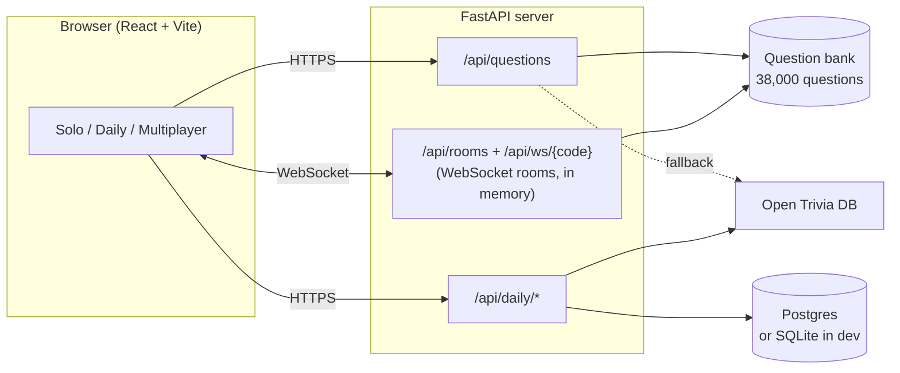

# Quizzr

[](https://github.com/jacobchen08/Quiz-App/actions/workflows/ci.yml)

A trivia game styled like a train station departure board. You can play on your own, take a daily challenge where everyone gets the same ten questions, or start a room and play live with friends. It has a bank of about 38,000 questions across 24 categories, built from [OpenTriviaQA](https://github.com/uberspot/OpenTriviaQA) and [Wikidata](https://www.wikidata.org), and uses the [Open Trivia Database](https://opentdb.com/) for the daily challenge.

The frontend is React and Vite. The backend is FastAPI, with WebSockets for the multiplayer rooms.

Built with assistance from Claude Code

<p align="center">
  
</p>

<p align="center">
  
  &nbsp;
  
</p>

## Features

- **Solo:** 1 to 50 questions from one or more categories, with optional filters for difficulty and question type, and an optional timer. At the end you see the questions you missed and get a result you can share.
- **Daily:** the same ten questions for everyone, once a day (the day changes at midnight UTC). The leaderboard sorts by correct answers, then time.
- **Multiplayer:** create a room and send friends the code or invite link. A right answer is worth 100 points, plus up to 50 more for speed. With a timer on, everyone answers each question at the same time.

It also handles reconnecting (reload mid-game and you're back in your seat), works offline for solo play once you've visited, and can be played from the keyboard: `A` to `D` to choose, `Enter` to submit, arrow keys to move between questions.

## How it works



Solo and multiplayer questions come from a question bank stored with the server (`backend/data/questions.json.gz`), so a round starts instantly and can mix any number of categories. The bank is built by a script from two openly licensed sources: OpenTriviaQA's hand-written questions, filtered and lightly repaired, and questions generated from Wikidata's facts, plus number trivia worked out by the script for Mathematics. Categories hold more questions the more popular they're likely to be (2,000 for General Knowledge or Film, 800 for Board Games), so a round on "any category" leans towards the popular ones. Open Trivia DB's live API is the fallback when the bank can't meet a quiz's settings, and it supplies the daily challenge. Its questions are never stored.

Solo play only needs the server to fetch questions. Answers are checked in the browser, since you're only playing against yourself.

In the daily challenge and in multiplayer, the correct answers stay on the server. Each one is only sent to the browser after you answer (or, in a timed game, when time runs out), so nobody can find them in dev tools. Daily results are stored in Postgres in production and in a SQLite file during development. Multiplayer rooms only live in the server's memory, so a restart ends any game in progress.

A few design choices worth explaining:

- When a player's connection drops without them leaving, the server holds their seat for 90 seconds. The browser keeps a token for that tab and uses it to rejoin. Without this, a phone switching apps for a moment would knock someone out of the game.
- Timed games run on the server's clock. Every update includes the server's current time, so each browser can count down to the same deadline, and answers that arrive too late are refused.
- There are no accounts. The daily challenge identifies you with a random token saved in your browser. Clearing your storage would give you a second attempt, which seemed like a fair trade for not making anyone sign up.
- Questions generated from Wikidata could easily read like a form ("Who painted X?" a thousand times). Each item can be asked about in several ways (forwards, backwards, as true or false, by decade), clues combine two or three facts ("Rembrandt's 1642 painting, now in the Rijksmuseum…"), wrong answers are picked from the same era or country so they're plausible, and how well known the item is sets the difficulty. A final check throws out any question that gives away its own answer.
- A daily run started just before midnight can still be finished after it. The browser sends the date the run started with each answer, and the server accepts it if that's today or yesterday.

## Running it locally

You'll need Python 3.12 or newer and Node 22 or newer. Start the API first:

```bash
cd backend
pip install -r requirements.txt
uvicorn main:app --reload --port 8000 --no-access-log
```

Then, in a second terminal, the app:

```bash
cd frontend
npm install
npm run dev
```

Open http://localhost:5173. The dev server forwards `/api` requests to the API on port 8000.

## Tests

```bash
# backend
pip install -r backend/requirements-dev.txt
python -m pytest backend

# frontend unit tests and end-to-end tests (run inside frontend/)
npm test
npx playwright install chromium firefox webkit   # once
npm run test:e2e
```

The backend tests cover fetching questions, multiplayer rooms (scoring, reconnecting, timed games), the daily challenge and rate limiting. The end-to-end tests play each mode in Chromium, Firefox and WebKit (the engine behind Safari), including a two-player game where one player reloads halfway through and a round on a phone-sized screen, and run accessibility checks in light and dark mode. They start their own copy of the API with fixed test questions, so they don't need the internet. Locally they skip Firefox unless you set `E2E_BROWSERS=chromium,firefox,webkit`, because some Windows security settings block Playwright's copy of it.

GitHub Actions runs everything on each push, and runs the daily challenge tests a second time against Postgres.

## Deploying

[`render.yaml`](render.yaml) sets up two services on [Render](https://render.com): the app as a static site and the API as a Docker container. Keeping them separate means the page loads straight away even when the free API server is asleep, and the app shows a message while it wakes up.

Render asks for three settings when you create the services:

- `DATABASE_URL` on the API: a Postgres connection string (a free [Neon](https://neon.tech) database works). Without it the daily leaderboard falls back to SQLite and is wiped every time Render restarts the server.
- `ALLOWED_ORIGINS` on the API: the app's address, like `quizzr.onrender.com`.
- `VITE_API_HOST` on the app: the API's address, like `quizzr-api.onrender.com`.

Render shows both addresses as soon as the services exist, and they can't be filled in automatically because Render only shares a service's private address between services, which browsers can't reach. The API address is built into the app, so after setting `VITE_API_HOST`, redeploy the static site.

The [`Dockerfile`](Dockerfile) can also run everything as a single service, with the API serving the built app.

## Project structure

```
backend/
  main.py           creates the FastAPI app and registers the routes
  trivia.py         decides where questions come from; talks to Open Trivia DB
  question_bank.py  draws questions from the bank
  data/             the question bank, and where its sources and licences are listed
  scripts/question_bank/  builds the bank from OpenTriviaQA and Wikidata
  multiplayer.py    multiplayer rooms over WebSockets
  daily.py          the daily challenge and its leaderboard
  database.py       Postgres or SQLite connections
  ratelimit.py      per-IP rate limits
  logs.py           JSON logging
  tests/

frontend/src/
  main.jsx          entry point
  App.jsx           the page layout and mode tabs
  modes/            Solo, Daily and Multiplayer, one folder each
  components/       pieces shared by the modes, like the question card and results
  hooks/            reusable React hooks
  lib/              logic with no React in it: API calls, scoring, browser storage
  styles/           one stylesheet per part of the page; tokens.css has the colours and fonts
frontend/e2e/       end-to-end tests
docs/               screenshots for this README
```

[`DESIGN.md`](DESIGN.md) describes the visual design and [`PRODUCT.md`](PRODUCT.md) covers who the app is for.

## Credits

Questions come from [OpenTriviaQA](https://github.com/uberspot/OpenTriviaQA) and the [Open Trivia Database](https://opentdb.com/), both under [CC BY-SA 4.0](https://creativecommons.org/licenses/by-sa/4.0/), and from facts in [Wikidata](https://www.wikidata.org) (public domain). The question bank is shared under CC BY-SA 4.0; see [`backend/data/README.md`](backend/data/README.md). The typeface is [Sofia Sans](https://github.com/lettersoup/Sofia-Sans), under the SIL Open Font License.
